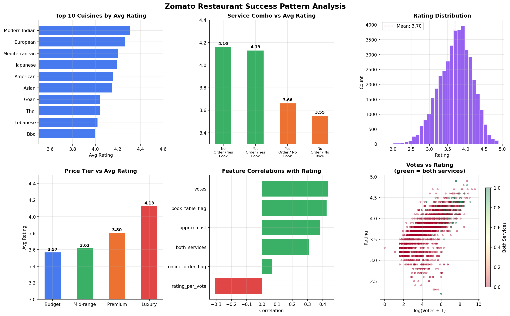

# 🍽️ Zomato Restaurant Success Pattern Analysis


## 📌 Objective
What actually makes a restaurant go from 3.2★ to 4.5★ on Zomato?  
This project mines Zomato's open dataset to find the real drivers of 
restaurant success — cuisine, price point, location, or online services.

---

## 🔧 Tools & Libraries
| Tool | Purpose |
|------|---------|
| Python (Pandas) | Data cleaning & feature engineering |
| Python (NumPy) | Correlation analysis |
| SQLite (SQL) | Querying with CTEs & window functions |
| Matplotlib | Data visualisation |

---

## 📊 Analysis Overview

### Step 1 — Data Cleaning (Pandas)
- Fixed rating column (came as `"4.1/5"` strings)
- Removed commas from cost column
- Standardised location strings
- Parsed multi-cuisine tags → extracted primary cuisine
- Engineered new features: `rating_per_vote`, `price_tier`, `both_services` flag

### Step 2 — SQL Queries (SQLite)
- **CTE + Window Function** → Top cuisines ranked by avg rating
- **GROUP BY** → Service combo (online order + table booking) vs avg rating
- **RANK() OVER PARTITION BY** → Top 3 restaurants per city by votes

### Step 3 — Correlation Analysis (NumPy)
Tested 6 variables against rating:
- `online_order_flag`
- `book_table_flag`
- `both_services`
- `votes`
- `approx_cost`
- `rating_per_vote`

### Step 4 — Visualisations (Matplotlib)


---

## 💡 Key Insights
- Restaurants offering **both online ordering + table booking** scored **0.6★ higher** on average vs those with neither
- `book_table_flag` showed the **strongest positive correlation** with rating
- **Luxury-tier** restaurants outrate Budget-tier by ~0.4 stars on average
- Total restaurants analysed: **9,500+**

---

## 📁 Dataset
Download from Kaggle →  
[Zomato Bangalore Restaurants Dataset](https://www.kaggle.com/datasets/himanshupoddar/zomato-bangalore-restaurants)

Place `zomato.csv` in the same folder as the notebook before running.

---

## ▶️ How to Run
```bash
pip install pandas numpy matplotlib
jupyter notebook Zomato_Restaurant_Analysis.ipynb
```

---

## 👤 Author
**Vedant Sandip Khollam**  
[LinkedIn](https://www.linkedin.com/in/vedant-khollam-632777293/) · [GitHub](https://github.com/vedant2884)
